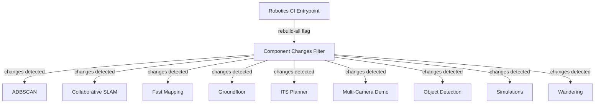

<!--
SPDX-FileCopyrightText: (C) 2026 Intel Corporation
SPDX-License-Identifier: Apache-2.0
-->

# GitHub Actions Workflows

This directory contains the GitHub Actions workflows for continuous integration, documentation and website deployment, security scanning, and automated maintenance across the Robotics AI Suite repository.

## Overview

| Workflow | File | Triggers | Description |
| --- | --- | --- | --- |
| Deploy Website | [.github/workflows/deploy-website.yaml](deploy-website.yaml) | `pull_request`, `push` (`main`), `workflow_dispatch` | Builds Sphinx and Docusaurus documentation, validates routes, runs Playwright browser tests, deploys pull request preview sites to AWS S3/CloudFront, and publishes the production documentation site. |
| [Robotics] CI | [.github/workflows/robotics-workflow.yaml](robotics-workflow.yaml) | `pull_request`, `push` (`main`, `release-*`), `workflow_dispatch` | Top-level dispatcher for component CI. Triggers on changes under [src/components/README.md](../../src/components/README.md) or workflow definitions, delegating to the component orchestrator. |
| Component CI Dispatcher | [.github/workflows/robotics-components.yaml](robotics-components.yaml) | `workflow_call` | Reusable change-detection orchestrator. Uses path filtering to selectively run checks only for modified components under [src/components/README.md](../../src/components/README.md), or all components when requested. |
| ADBSCAN | [.github/workflows/robotics-components-adbscan.yaml](robotics-components-adbscan.yaml) | `workflow_call` | Reusable license compliance check for the ADBSCAN component. |
| Collaborative SLAM | [.github/workflows/robotics-components-collaborative-slam.yaml](robotics-components-collaborative-slam.yaml) | `workflow_call` | Reusable license compliance check for Collaborative SLAM. |
| Fast Mapping | [.github/workflows/robotics-components-fast-mapping.yaml](robotics-components-fast-mapping.yaml) | `workflow_call` | Reusable CI for Fast Mapping: lints code, runs ROS 2 test suite across Humble and Jazzy, and produces Debian package artifacts. |
| Groundfloor | [.github/workflows/robotics-components-groundfloor.yaml](robotics-components-groundfloor.yaml) | `workflow_call` | Reusable license compliance check for Groundfloor Segmentation. |
| ITS Planner | [.github/workflows/robotics-components-its-planner.yaml](robotics-components-its-planner.yaml) | `workflow_call` | Reusable license compliance check for ITS Planner. |
| Multi-Camera Demo | [.github/workflows/robotics-components-multicam-demo.yaml](robotics-components-multicam-demo.yaml) | `workflow_call` | Reusable linting and license compliance checks for Multi-Camera Demo. |
| Object Detection | [.github/workflows/robotics-components-object-detection.yaml](robotics-components-object-detection.yaml) | `workflow_call` | Reusable license compliance check for Object Detection. |
| Simulations | [.github/workflows/robotics-components-simulations.yaml](robotics-components-simulations.yaml) | `workflow_call` | Reusable license compliance check for AMR Simulations. |
| Wandering | [.github/workflows/robotics-components-wandering.yaml](robotics-components-wandering.yaml) | `workflow_call` | Reusable license compliance check for Wandering AMR application. |
| Skill Scanner | [.github/workflows/skill-scan.yaml](skill-scan.yaml) | `pull_request`, `push` (`main`), `schedule` (daily), `workflow_dispatch` | Discovers agent skill folders and scans them for security risks (SkillSpector) and structural conformity (skill-validator). |
| Zizmor scan | [.github/workflows/zizmor-scan.yaml](zizmor-scan.yaml) | `pull_request`, `push` (`main`), `schedule` (daily), `workflow_dispatch` | Static analysis security scanner for GitHub Actions workflows, reporting findings to GitHub Code Scanning. |
| [SIV] Weekly Build Tagging | [.github/workflows/siv-weekly-tag.yaml](siv-weekly-tag.yaml) | `schedule` (weekly Tuesdays), `workflow_dispatch` | Automatically checks and updates git submodules to upstream commits, opens and merges an update PR, and creates an annotated weekly release tag. |

---

## Detailed Workflow Breakdown

### Documentation & Website Deployment

#### [.github/workflows/deploy-website.yaml](deploy-website.yaml)

- **Name**: `Deploy Website`
- **Trigger Events**:
  - `pull_request`: On `opened`, `synchronize`, `reopened`, and `closed` events.
  - `push`: Direct pushes to the `main` branch.
  - `workflow_dispatch`: Manual execution.
- **Concurrency**: Grouped by workflow name and PR number or git ref (`cancel-in-progress: true`).
- **Key Jobs**:
  1. `build`:
     - Checks out the repository.
    - Sets up Node.js 22.12.0 with npm caching via [docs/website/package.json](../../docs/website/package.json).
     - Builds the Sphinx documentation and Docusaurus static site into the build output directory with the appropriate `BASE_URL` (`/pr/<number>/` for PRs or `/` for production).
     - Installs Chromium via Playwright and executes website integration tests (`make test-website`).
     - Verifies route generation, asset paths, and sitemaps for pull request previews.
     - Uploads the built website as an artifact.
  2. `deploy`:
     - Deploys the built site artifact to AWS S3 using OIDC role assumption.
     - **Pull requests**: Syncs to the preview directory `pr/<number>` in S3, invalidates the CloudFront cache path, and posts or updates a PR comment with the live preview link.
     - **Main branch**: Syncs to the root bucket destination (excluding `pr/*`) and invalidates the full CloudFront cache.
  3. `cleanup-pr-preview`:
     - Runs when a pull request is `closed`.
     - Deletes the corresponding preview directory `pr/<number>` from the S3 bucket and issues a CloudFront cache invalidation.

---

### Robotics Component CI (AMR)

The robotics CI pipeline uses a tiered, path-filtered architecture to avoid redundant builds when changing specific components.

#### [.github/workflows/robotics-workflow.yaml](robotics-workflow.yaml)

- **Name**: `[Robotics] CI`
- **Trigger Events**:
  - `pull_request` and `push` to `main` and `release-*` branches when changes occur in workflow definitions or component source directories under [src/components/README.md](../../src/components/README.md) (ignoring component docs directories).
  - `workflow_dispatch`: Accepts a `rebuild-all` boolean input (defaults to `true`) to force builds for all components regardless of changed paths.
- **Key Jobs**:
  - `build-components`: Calls [.github/workflows/robotics-components.yaml](robotics-components.yaml).

#### [.github/workflows/robotics-components.yaml](robotics-components.yaml)

- **Trigger Event**: `workflow_call` (accepts `rebuild-all` boolean input).
- **Key Jobs**:
  - `check-changes`: Uses `dorny/paths-filter` to detect changes within each component directory under [src/components/README.md](../../src/components/README.md).
  - Component-specific jobs: Dispatches to the respective reusable workflow for any component with changes detected or when `rebuild-all` is true.

#### Component Workflows

All component workflows are defined as reusable workflows (`workflow_call`) that run from their component directory:

| Component Workflow | Component Path | Checks & Steps |
| --- | --- | --- |
| [.github/workflows/robotics-components-adbscan.yaml](robotics-components-adbscan.yaml) | [src/components/adbscan/README.md](../../src/components/adbscan/README.md) | Runs REUSE license validation (`make license-check`). |
| [.github/workflows/robotics-components-collaborative-slam.yaml](robotics-components-collaborative-slam.yaml) | [src/components/collaborative-slam/README.md](../../src/components/collaborative-slam/README.md) | Runs REUSE license validation (`make license-check`). |
| [.github/workflows/robotics-components-fast-mapping.yaml](robotics-components-fast-mapping.yaml) | [src/components/fast-mapping/README.md](../../src/components/fast-mapping/README.md) | - `lint`: Code linting (`make lint`). - `license-check`: REUSE license check (`make license-check`). - `build-test`: ROS 2 build & test matrix (`humble`, `jazzy`) with test result artifact upload. - `build-package`: ROS 2 package build matrix (`humble`, `jazzy`) producing and uploading Debian package (`.deb`) artifacts. |
| [.github/workflows/robotics-components-groundfloor.yaml](robotics-components-groundfloor.yaml) | [src/components/groundfloor/README.md](../../src/components/groundfloor/README.md) | Runs REUSE license validation (`make license-check`). |
| [.github/workflows/robotics-components-its-planner.yaml](robotics-components-its-planner.yaml) | [src/components/its-planner/README.md](../../src/components/its-planner/README.md) | Runs REUSE license validation (`make license-check`). |
| [.github/workflows/robotics-components-multicam-demo.yaml](robotics-components-multicam-demo.yaml) | [src/components/multicam-demo/README.md](../../src/components/multicam-demo/README.md) | - `lint`: Code linting (`make lint`). - `license-check`: REUSE license check (`make license-check`). |
| [.github/workflows/robotics-components-object-detection.yaml](robotics-components-object-detection.yaml) | [src/components/object-detection/README.md](../../src/components/object-detection/README.md) | Runs REUSE license validation (`make license-check`). |
| [.github/workflows/robotics-components-simulations.yaml](robotics-components-simulations.yaml) | [src/components/simulations/README.md](../../src/components/simulations/README.md) | Runs REUSE license validation (`make license-check`). |
| [.github/workflows/robotics-components-wandering.yaml](robotics-components-wandering.yaml) | [src/components/wandering/README.md](../../src/components/wandering/README.md) | Runs REUSE license validation (`make license-check`). |

---

### Security & Static Analysis

#### [.github/workflows/zizmor-scan.yaml](zizmor-scan.yaml)

- **Name**: `Zizmor scan`
- **Purpose**: Static security analysis of GitHub Actions workflows to detect misconfigurations, dangerous triggers, credential leakage, and injection risks.
- **Trigger Events**:
  - `push` to `main`
  - `pull_request` targeting `main`
  - `schedule`: Daily at 02:00 UTC
  - `workflow_dispatch`: Manual run
- **Behavior**:
  - Uses `open-edge-platform/geti-ci/actions/zizmor`.
  - On pull requests: Scans changed workflows only with `severity-level: HIGH` and fails on findings.
  - On scheduled/push runs: Scans all workflows with `severity-level: LOW`.
  - Outputs results to GitHub Code Scanning dashboard via `security-events: write`.

#### [.github/workflows/skill-scan.yaml](skill-scan.yaml)

- **Name**: `Skill Scanner`
- **Purpose**: Validates agent skills stored in the repository for security vulnerabilities and format compliance.
- **Trigger Events**:
  - `pull_request`: On changes to skill definition files or [.github/workflows/skill-scan.yaml](skill-scan.yaml).
  - `push` to `main`.
  - `schedule`: Daily at 02:00 UTC.
  - `workflow_dispatch`: Accepts a `severity` input (`CRITICAL`, `HIGH`, `MEDIUM`, `LOW`).
- **Key Jobs**:
  1. `discover-skills`: Dynamically identifies all directories named `.github/skills` or `skills` across the workspace.
  2. `skillspector-scan`: Runs `open-edge-platform/geti-ci/actions/skill-scan` across each discovered path via matrix strategy to detect security issues.
  3. `skill-validator-scan`: Runs `open-edge-platform/geti-ci/actions/skill-validator` to ensure skill definitions comply with required schemas and allowed directory structures.

---

### Automated Maintenance

#### [.github/workflows/siv-weekly-tag.yaml](siv-weekly-tag.yaml)

- **Name**: `[SIV] Weekly Build Tagging`
- **Purpose**: Automated weekly cadence workflow to synchronize submodules and create tagged weekly build snapshots.
- **Trigger Events**:
  - `schedule`: Every Tuesday at 15:00 UTC (`0 15 * * 2`).
  - `workflow_dispatch`: Manual execution.
- **Process**:
  1. Checks out the repository and all submodules recursively.
  2. Updates non-shallow submodules to their latest upstream commits (`git submodule update --remote`).
  3. If submodule pointer changes are detected:
     - Creates a commit on an auto-generated branch (`siv-auto-update-submodules-<timestamp>`).
     - Pushes the branch and opens a pull request.
     - Automatically squash-merges the pull request into the target branch.
  4. Generates an annotated Git tag using the format `<TAG_PREFIX>-<YYYYMMDD>` (configured via `vars.SIV_WEEKLY_BUILD_PREFIX`) pointing to the latest commit.
