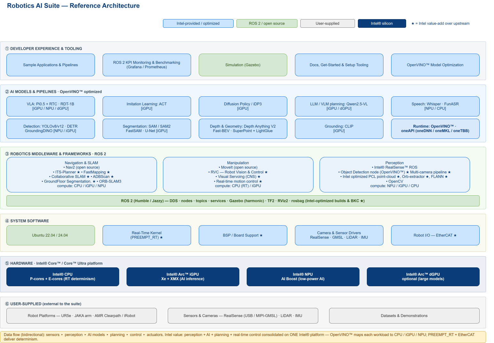
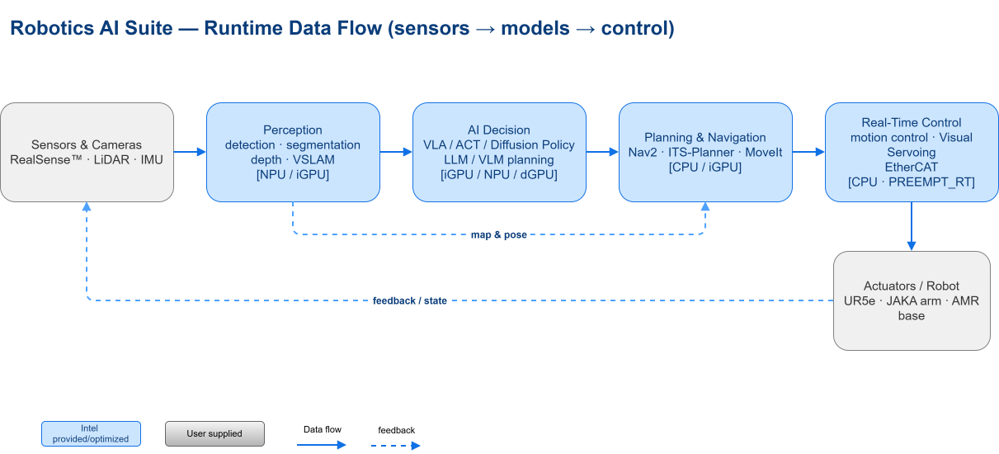
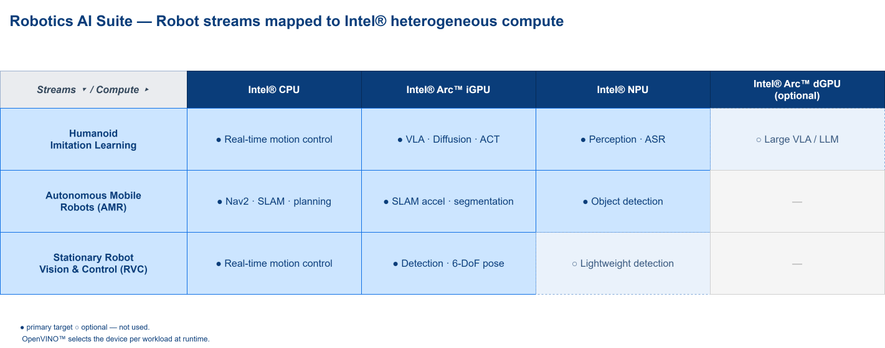

# Robotics AI Suite

The **Robotics AI Suite** is a collection of robotics applications, libraries, samples, and benchmarking tools to help you build solutions faster. It includes models and pipelines optimized with the OpenVINO™ toolkit for accelerated performance on Intel® CPUs, integrated GPUs, and NPUs. Refer to the [detailed user guide and documentation](https://developer.robotics.intel.com/development-stack/ai-suite-robotics/).

The **Robotics AI Suite** is organized into **collections** that group workflows and capabilities for different robot categories. Each collection provides:

- Libraries for core robotics workloads and control recipes.
- Integration with ROS 2, supported sensor profiles, and benchmarking tools.
- OpenVINO™-optimised models for computer vision, large language models (LLMs), and vision-language-action (VLA).
- Hardware acceleration on Intel® CPUs, integrated GPUs, and NPUs for faster inference.

The types of collection are as follows:

- **Autonomous Mobile Robot**
  For robots that navigate and operate independently in dynamic environments such as warehouses or factories.
- **Humanoid Robot**
  For robots that learn and replicate human actions to perform interactive or assistive tasks.
- **Stationary Arm**
  For fixed-position robots using vision systems for tasks like inspection, assembly, or quality control.

## Architecture

The diagram below is the single, consolidated view of the Robotics AI Suite. It shows the major software components, how perception, navigation, manipulation, Physical AI, and benchmarking relate, which parts are Intel-provided versus upstream open source, and how workloads map onto Intel® heterogeneous compute (CPU / iGPU / NPU). You should be able to understand what the suite includes — and where Intel adds value — without reading further.



**How to read it**

- Colour tells you ownership: **Intel-provided / optimized** (blue), **ROS 2 / upstream open source** (green), **Intel® silicon** (dark blue), and **user-supplied** robot, sensors, and datasets (grey). A **★** marks Intel value-add over the upstream component.
- The stack is layered top-to-bottom: **developer experience & tooling**, **AI models & pipelines** (OpenVINO™-optimized), **robotics middleware & frameworks** on **ROS 2**, **system software** (real-time kernel, drivers, EtherCAT), and the **Intel® Core™ / Core™ Ultra** hardware. Everything above the hardware line is what you consolidate onto a single Intel platform.

**What you get, and how it fits together**

- **Perception, navigation, and manipulation** are ROS 2 stacks. Intel adds optimized components on top of upstream Nav2, MoveIt, and ORB-SLAM3 — ITS-Planner, FastMapping, Collaborative SLAM, ADBScan, and GroundFloor Segmentation for AMRs; Robot Vision & Control (RVC) and Visual Servoing (CNS) for stationary arms.
- **Physical AI / Embodied models** — VLA (Pi0.5+RTC, RDT-1B), ACT, and Diffusion Policy / iDP3 — plus **LLM / VLM task planning** run through the OpenVINO™ runtime and oneAPI.
- **Benchmarking & tooling** — ROS 2 KPI monitoring, Gazebo simulation, sample applications, and model-optimization / setup tooling — sit in the top developer-experience layer.

**Where Intel accelerates the workload**

Perception and detection run on the **NPU / iGPU**; VLA / diffusion policies and LLM / VLM planning on the **iGPU** (optionally a discrete **Arc™ GPU**); deterministic motion control and planning on the **CPU** with a `PREEMPT_RT` kernel and EtherCAT. OpenVINO™ selects the device per workload, so perception, AI, planning, and real-time control are consolidated on one Intel® platform.

### Runtime data flow

Sensor data flows through perception into the AI decision models, then to planning and real-time control, and out to the actuators — with feedback closing the loop. Each stage is annotated with the compute it targets.



### Workloads mapped to Intel hardware

Each collection uses Intel heterogeneous compute differently. The matrix summarizes the primary (●) and optional (○) compute target for each collection.



The per-collection reference application architectures — which zoom into a representative end-to-end application — are shown on the collection pages linked in the tables below.

**Humanoid - Imitation Learning:**

| Application | Documentation | Description |
| ----------- | ------------- | ----------- |
| [Diffusion Policy (OpenVINO Toolkit)](src/pipelines/diffusion-policy-ov) | [Diffusion Policy (OpenVINO Toolkit)](https://developer.robotics.intel.com/development-stack/software_references/humanoid/sample_pipelines/diffusion_policy/) | Diffusion Policy implementation optimized with OpenVINO toolkit |
| [Imitation Learning - ACT](src/pipelines/act-sample) | [Imitation Learning - ACT](https://developer.robotics.intel.com/development-stack/software_references/humanoid/sample_pipelines/imitation_learning_act/) | Imitation learning pipeline using Action Chunking with Transformers(ACT) algorithm to train and evaluate in simulated or real robot environments with Intel® optimization |
| [Improved 3D Diffusion Policy (OpenVINO Toolkit)](src/pipelines/idp3-ov) | [Improved 3D Diffusion Policy (OpenVINO Toolkit)](https://developer.robotics.intel.com/development-stack/ai_resources/openvino/models/model_idp3/) | Improved 3D Diffusion Policy implementation optimized with OpenVINO toolkit |
| [LLM Robotics Demo](src/pipelines/llm-robotics-demo) | [LLM Robotics Demo](https://developer.robotics.intel.com/development-stack/software_references/humanoid/sample_pipelines/llm_robotics/) | Step-by-step guide for setting up a real-time system to control a JAKA robot arm with movement commands generated using an LLM |
| [Pi0.5 with Real-Time Chunking (OpenVINO Toolkit)](src/pipelines/pi05-rtc-ov) | [Pi0.5 with Real-Time Chunking (OpenVINO Toolkit)](https://developer.robotics.intel.com/development-stack/software_references/humanoid/sample_pipelines/pi05_with_rtc/) | Implementation of Pi0.5 VLA model with Real-Time Chunking (RTC) optimized with the OpenVINO toolkit |
| [Robotics Diffusion Transformer (OpenVINO Toolkit)](src/pipelines/rdt-ov) | [Robotics Diffusion Transformer (OpenVINO Toolkit)](https://developer.robotics.intel.com/development-stack/software_references/humanoid/sample_pipelines/robotics_diffusion_transformer/) | Robotics Diffusion Transformer implementation optimized with OpenVINO toolkit |
| [VSLAM: ORB-SLAM3](src/pipelines/orb-slam3-sample) | [VSLAM: ORB-SLAM3](https://developer.robotics.intel.com/development-stack/software_references/humanoid/sample_pipelines/ORB_VSLAM/) | One of the popular real-time feature-based SLAM libraries that can perform Visual, Visual-Inertial and Multi-Map SLAM with monocular, stereo and RGB-D cameras, using pin-hole and fish-eye lens models |
| [Gr00t n1.7 (OpenVINO Toolkit)](src/pipelines/gr00t-n1d7-ov) | [Gr00t n1.7 (OpenVINO Toolkit)](https://developer.robotics.intel.com/development-stack/ai_resources/openvino/models/model_gr00t_n1d7/) | Implementation of Gr00t n1.7 VLA model optimized with the OpenVINO toolkit |
| [GR00T-WholeBodyControl (OpenVINO Toolkit)](src/pipelines/gr00t-wbc) | [GR00T-WholeBodyControl (OpenVINO Toolkit)](https://developer.robotics.intel.com/development-stack/software_references/humanoid/sample_pipelines/gr00t_wbc/) | Implementation of GR00T-WholeBodyControl pipeline on Intel PLT platform optimized with the OpenVINO toolkit |

**Autonomous Mobile Robot:**

| Algorithm | Documentation | Description |
| --------- | ------------- | ----------- |
| [ADBScan](src/components/adbscan) | [ADBScan](https://developer.robotics.intel.com/development-stack/components/optimized_solutions/adbscan-follow-me/) | ADBSCAN (Adaptive DBSCAN) is an Intel-patented algorithm. It is a highly adaptive and scalable object detection and localization (clustering) algorithm, tested successfully to detect objects at all ranges for 2D Lidar, 3D Lidar, and RealSense™ depth camera. |
| [Collaborative-SLAM](src/components/collaborative-slam) | [Collaborative-SLAM](https://developer.robotics.intel.com/development-stack/components/optimized_solutions/collaborative-slam/) | A Collaborative Visual SLAM example that is compiled natively for both Intel® Core™ and Intel® Atom® processor-based systems. In addition, GPU acceleration may be enabled on selected Intel® Core™ processor-based system. |
| [Fastmapping](src/components/fast-mapping) | [Fastmapping](https://developer.robotics.intel.com/development-stack/components/optimized_solutions/run-fastmapping-algorithm/) | FastMapping application is the Intel® optimized version of octomap. |
| [GroundFloor Segmentation](src/components/groundfloor) | [GroundFloor Segmentation](https://developer.robotics.intel.com/development-stack/components/sensors/reference_applications/pointcloud-groundfloor-segmentation/) | Showcases an Intel® algorithm designed for the segmentation of depth sensor data, compatible with 3D LiDAR or a RealSense™ camera inputs |
| [ITS-Planner](src/components/its-planner) | [ITS-Planner](https://developer.robotics.intel.com/development-stack/components/navigation/its-path-planner-plugin/) | Intelligent Sampling and Two-Way Search (ITS) global path planner is an Intel-patented algorithm. ITS is a new search approach based on two-way path planning and intelligent sampling, which reduces the compute time by about 20x-30x on a 1000-node map comparing with the A* search algorithm. |
| [Multi-Camera-Demo](src/components/multicam-demo) | [Multicam-Demo](https://developer.robotics.intel.com/development-stack/ai_resources/openvino/reference_applications/openvino_multicam_demo/) | Demonstrates the multi-camera use case using an Axiomtek ROBOX500 ROS2 AMR controller and four RealSense™ depth cameras D457 |
| [Object Detection](src/components/object-detection) | [Object Detection](https://developer.robotics.intel.com/development-stack/ai_resources/openvino/reference_applications/object_detection_tutorial/) | An example on using the ROS 2 node with OpenVINO toolkit. It outlines the steps for installing the node and executing the object detection model. |
| [Simulations](src/components/simulations) | [Simulations](https://developer.robotics.intel.com/development-stack/software_references/amr/simulation/) | Tutorials on using the ROS 2 simulations with the Autonomous Mobile Robot. You can test robot sensing and navigation in these simulated environments. |
| [Wandering](src/components/wandering) | [Wandering](https://developer.robotics.intel.com/development-stack/software_references/amr/simulation/wandering_sim/) | Wandering mobile robot application is a ROS 2 sample application. It can be used with different SLAM algorithms in combination with the ROS2 navigation stack, to move the robot around in an unknown environment. The goal is to create a navigational map of the environment. |

**Stationary Robot Vision & Control:**

| Application | Documentation | Description |
| ----------- | ------------- | ----------- |
| [Stationary Robot Vision & Control](src/robot-vision-control) | [Stationary Robot Vision & Control](https://developer.robotics.intel.com/development-stack/hardware_blueprints/stationary_arm/) | Stationary Robot Vision & Control is a robotic software framework aimed at tackling pick-and-place and track-and-place industrial problems. This is under active development, hence released in the *pre-release* quality. |

**OpenVINO™ Toolkit-Optimized Model Algorithms:**

| Algorithm | Description |
| --------- | ----------- |
| [YOLOv8](https://developer.robotics.intel.com/development-stack/ai_resources/openvino/models/) | CNN-based object detection |
| [YOLOv12](https://developer.robotics.intel.com/development-stack/ai_resources/openvino/models/) | CNN-based object detection |
| [MobileNetV2](https://developer.robotics.intel.com/development-stack/ai_resources/openvino/models/) | CNN-based object detection |
| [SAM](https://developer.robotics.intel.com/development-stack/ai_resources/openvino/models/) | Transformer-based segmentation |
| [SAM2](https://developer.robotics.intel.com/development-stack/ai_resources/openvino/models/) | Extends SAM for video segmentation and object tracking with cross attention to memory |
| [FastSAM](https://developer.robotics.intel.com/development-stack/ai_resources/openvino/models/) | Lightweight substitute to SAM |
| [MobileSAM](https://developer.robotics.intel.com/development-stack/ai_resources/openvino/models/) | Lightweight substitute to SAM (Same model architecture with SAM. Refer to the OpenVINO toolkit and Segment Anything Model (SAM) tutorials for model exporting and application) |
| [U-NET](https://developer.robotics.intel.com/development-stack/ai_resources/openvino/models/) | CNN-based segmentation and diffusion model |
| [DETR](https://developer.robotics.intel.com/development-stack/ai_resources/openvino/models/) | Transformer-based object detection |
| [DETR GroundingDino](https://developer.robotics.intel.com/development-stack/ai_resources/openvino/models/) | Transformer-based object detection |
| [CLIP](https://developer.robotics.intel.com/development-stack/ai_resources/openvino/models/) | Transformer-based image classification |
| [Qwen2.5VL](https://developer.robotics.intel.com/development-stack/ai_resources/openvino/models/) | Multimodal large language model |
| [Whisper](https://developer.robotics.intel.com/development-stack/ai_resources/openvino/models/) | Automatic speech recognition |
| [FunASR](https://developer.robotics.intel.com/development-stack/ai_resources/openvino/models/) | Automatic speech recognition |
| [Action Chunking with Transformers - ACT](https://developer.robotics.intel.com/development-stack/ai_resources/openvino/models/model_act/) | An end-to-end imitation learning model designed for fine manipulation tasks in robotics |
| [Visual Servoing - CNS](https://developer.robotics.intel.com/development-stack/ai_resources/openvino/models/model_cns/) | A technique that uses feedback information extracted from a vision sensor to control robot motion |
| [Diffusion Policy](https://developer.robotics.intel.com/development-stack/ai_resources/openvino/models/model_dp/) | The ability to learn the gradient of the action distribution score function and optimize through the stochastic Langevin dynamics steps during inference provides a stable and efficient way to find optimal actions |
| [Improved 3D Diffusion Policy (iDP3)](https://developer.robotics.intel.com/development-stack/ai_resources/openvino/models/model_idp3/) | Improved 3D Diffusion Policy (iDP3) builds upon the original Diffusion Policy framework by enhancing its capabilities for 3D robotic manipulation tasks |
| [Robotics Diffusion Transformer (RDT-1B)](https://developer.robotics.intel.com/development-stack/ai_resources/openvino/models/model_rdt/) | Robotics Diffusion Transformer with 1.2B parameters (RDT-1B), is a diffusion-based foundation model for robotic manipulation |
| [Feature Extraction Model: SuperPoint](https://developer.robotics.intel.com/development-stack/ai_resources/openvino/models/model_superpoint/) | A self-supervised framework for interest point detection and description in images, suitable for a large number of multiple-view geometry problems in computer vision |
| [Feature Tracking Model: LightGlue](https://developer.robotics.intel.com/development-stack/ai_resources/openvino/models/model_lightglue/) | A model designed for efficient and accurate feature matching in computer vision tasks |
| [Bird’s Eye View Perception: Fast-BEV](https://developer.robotics.intel.com/development-stack/ai_resources/openvino/models/model_fastbev/) | Obtaining a Bird's Eye View (BEV) perception is to gain a comprehensive understanding of the spatial layout and relationships between objects in a scene |
| [Monocular Depth Estimation: Depth Anything V2](https://developer.robotics.intel.com/development-stack/ai_resources/openvino/models/model_depthanythingv2/) | A powerful tool that leverages deep learning to infer 3D information from 2D images |

## Website

The documentation website combines two tools:
- **Docusaurus (`docs/website/`)** serves as the root site (`/`), providing the landing pages, models catalog, navigation, and theme.
- **Sphinx (`docs/user-guide/`)** builds the in-depth user guide and technical documentation, mounted and served under `/development-stack/`.

Build and serve the complete site locally with:

```bash
make serve
```

`make serve` rebuilds the site with the current `BASE_URL` before serving it, so an earlier preview build cannot leave stale asset paths. Use `make build` (or `make website`) to build without serving. For a PR-style preview:

```bash
BASE_URL=/pr/2/ make serve
```

To serve both versions at once, set a different port for the preview: `BASE_URL=/pr/2/ PORT=3002 make serve`. Each server keeps its own build snapshot, so rebuilding one does not change assets served by the other.

For editing Sphinx documentation directly with live reloading, you can also run `make -C docs serve`.

## Build Targets

The top-level `Makefile` coordinates site and component workflows:

| Target | Description | Status |
| --- | --- | --- |
| `make help` | Print help for all available targets | Active |
| `make website` / `make build` | Build the complete documentation website | Active |
| `make serve` | Build and serve the complete documentation website locally | Active |
| `make build-components` | Build all component packages across `src/` | Placeholder (pending CMake orchestration) |
| `make test` | Run tests across component packages | Placeholder (pending CMake orchestration) |
| `make package` | Package all components (e.g. CPack / Debian packages) | Placeholder (pending CMake orchestration) |

*Note on component targets:* `build-components`, `test`, and `package` are placeholders pending unified CMake orchestration across all packages. See [src/components/README.md](src/components/README.md#building-and-packaging) for current per-component build instructions and future orchestration plans.

## Contribute

Read the [CONTRIBUTING.md](CONTRIBUTING.md) for guidelines on submitting issues and pull requests.

## Community and Support

For support, submit your bug report and feature request to [Github Issues](https://github.com/open-edge-platform/robotics-ai-suite/issues).

## License

The **Robotics AI Suite** project is licensed under the [APACHE 2.0](LICENSE).  

## Third-Party

Applications in this repository which are based on third-party content are:

| Sample Application                                              | Third-Party Application                                  |
|:----------------------------------------------------------------|:---------------------------------------------------------|
|[ACT Sample](src/pipelines/act-sample)             | [ACT](https://github.com/tonyzhaozh/act)                 |
|[ORB-SLAM3 Sample](src/pipelines/orb-slam3-sample) | [ORB-SLAM3](https://github.com/UZ-SLAMLab/ORB_SLAM3.git) |

## Intended Use

Applications developed in this repository, unless stated otherwise, are intended for reference
and demonstration purposes, not for production environments.
Certain features, such as authentication, TLS termination, and external access controls are
assumed to be covered at the infrastructure level.

For more information, refer to the
[Notes on Usage](https://docs.openedgeplatform.intel.com/dev/OEP-articles/notes-on-usage.html)
document.
