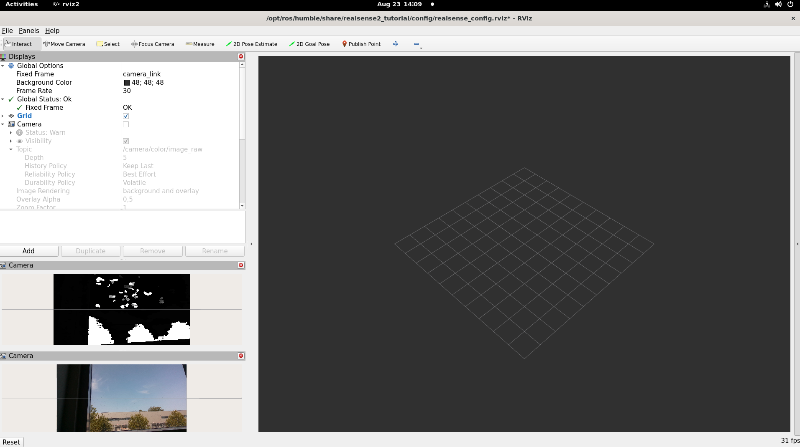
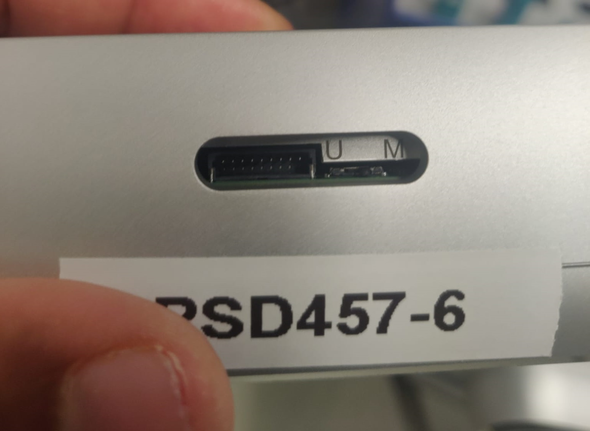
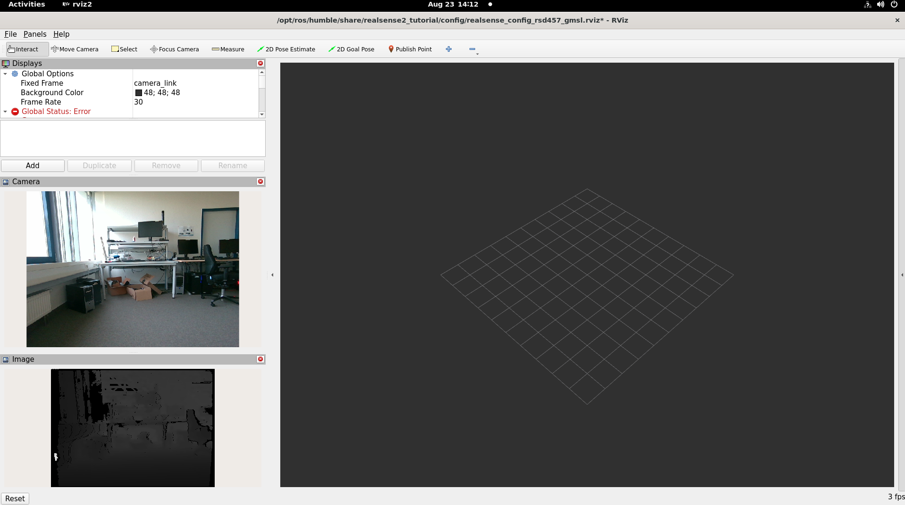

```{eval-rst}
.. meta::
   :description: Deploy and validate RealSense camera integration with ROS 2, resulting in camera data publication and image visualization through RViz2.
```


# RealSense Cameras with ROS 2

This section shows how to install and run a ROS 2 sample application that uses RealSense cameras and ROS Visualization 2 (RViz2).

You will learn how to:

- Launch ROS nodes for a camera.
- List ROS topics.
- Confirm that RealSense camera topics are publishing data.
- Retrieve data from the RealSense camera.
- Visualize an image from the RealSense camera in RViz2.

You can run this sample application using two different types of RealSense cameras,
explained further in this section:

- A RealSense camera connected through USB, for example, the RealSense D435i.
- A [RealSense Depth Camera D457](https://www.realsenseai.com/products/d457-gmsl-fakra/).


> [!NOTE]
> Currently USB cameras are the only supported cameras.

## Prerequisites

Complete the [Getting Started guide](../../../platform_foundation/getting_started) before continuing.

## Install the RealSense ROS 2 Sample Application

1. Download and install the RealSense camera with ROS 2 sample application:

   ::::{tab-set}
   :::{tab-item} **Jazzy**
   :sync: jazzy

   ```bash
   sudo apt-get install -y ros-jazzy-realsense2-tutorial-demo
   ```

   :::
   :::{tab-item} **Humble**
   :sync: humble

   ```bash
   sudo apt-get install -y ros-humble-realsense2-tutorial-demo
   ```

   :::
   ::::

2. Run `find_cameras.sh` to detect the connected camera type:

   ```bash
   /opt/ros/$ROS_DISTRO/share/realsense2_tutorial/scripts/find_cameras.sh
   ```

## Using RealSense camera connected through USB

1. Connect a RealSense camera (for example, RealSense D435i)
   to the host, through USB.

2. Run the RealSense camera with ROS 2 sample application, passing the
   `camera_type` value reported by `find_cameras.sh` (it defaults to `usb`):

   ```bash
   ros2 launch realsense2_tutorial realsense2_tutorial.launch.py camera_type:=usb
   ```

   Expected output: The image from the RealSense camera is displayed in rviz2, on the bottom left side.

   

3. To close this, do the following:

   - Type ``Ctrl-c`` in the terminal where the tutorial was run.

## Using [RealSense Depth Camera D457](https://www.realsenseai.com/products/d457-gmsl-fakra/) over GMSL

Connect the RealSense Depth Camera D457 to a GMSL-enabled platform, then power on the target.

> [!NOTE]
> Select the "MIPI" mode of the RealSense Depth Camera D457
> by moving the select switch on the camera to "M", as shown in the picture below:
> 

Follow the [GMSL Cameras guide](../cameras/gmsl/index.md) to configure the BIOS,
install the GMSL driver, and bind the RealSense D457 camera (the **RealSense**
tab of the "Bind GMSL camera" step) before continuing.

### Run the RealSense camera with ROS 2 sample application

1. Run the RealSense camera with ROS 2 sample application, passing the
   `camera_type` value reported by `find_cameras.sh`:

   ```bash
   ros2 launch realsense2_tutorial realsense2_tutorial.launch.py camera_type:=gmsl
   ```

   Expected output: The image from the RealSense camera is displayed in rviz2, on the bottom left side.

   

2. To close this, do the following:

   - Type ``Ctrl-c`` in the terminal where the tutorial was run.
