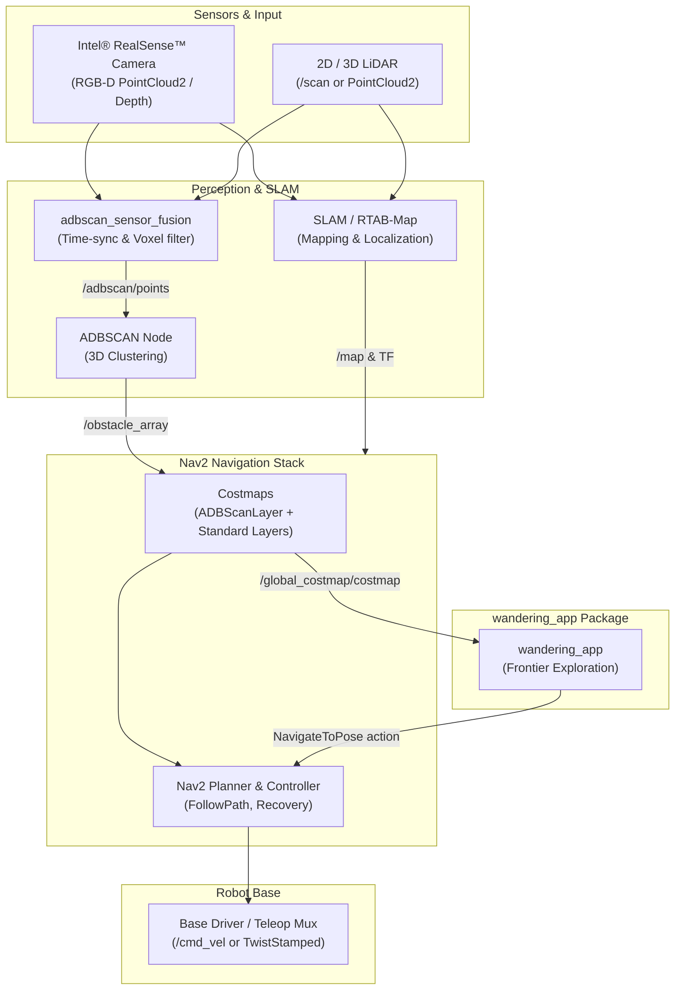

<!--
Copyright (C) 2026 Intel Corporation

SPDX-License-Identifier: Apache-2.0
-->

# `wandering` - Mobile Robot Application

## Documentation

Comprehensive documentation on this component is available here: [dev guide](https://developer.robotics.intel.com/development-stack/software_references/amr/simulation/wandering_sim/).

## Overview

The `wandering` mobile robot application is a Robot Operating System 2 (ROS 2) sample application that autonomously navigates a robot around an environment while avoiding obstacles and updating a real-time occupancy grid map published over ROS topics.

The application core consists of Intel-developed ROS 2 packages: `wandering_app` for frontier exploration, `adbscan_sensor_fusion` for time-synchronized point-cloud fusion, `nav2_adbscan_layer` for costmap obstacle marking, and `wandering_bringup` for system launch orchestration and configuration. To function as a complete autonomous system, it integrates with the `adbscan_ros2` 3D clustering node, Intel® RealSense™ ROS wrapper, SLAM frameworks (RTAB-Map for visual RGB-D mapping or SLAM Toolbox for 2D LiDAR SLAM), the Nav2 navigation stack, and platform-specific robot drivers.

This architecture is illustrated in the diagram below:



For further details on the sensor fusion pipeline and costmap layer integration, see the [Bringup Perception Architecture](src/wandering_bringup/README.md#architecture).

## Get Started

### System Requirements

Prepare the target system following the [official documentation](https://developer.robotics.intel.com/development-stack/platform_foundation/getting_started/).

### Build

Install a matching ROS distribution, CMake with CPack, and Debian packaging tools on the build host:

```bash
sudo apt update
sudo apt install cmake ninja-build dpkg-dev python3-colcon-common-extensions python3-rosdep
```

To build Debian packages, export `ROS_DISTRO` to the desired platform and run `make package`. This uses the installed ROS environment at `/opt/ros/${ROS_DISTRO}`. Built packages will be placed under `build/debian-packages/packages/`. The following command is an example for `Jazzy` distribution.

The `ci.package_components` list in `robotics-project.json` selects the components built by local `make package` and `make test` targets as well as CI packaging and promotion. Package manifests remain the source of truth for the packages actually published and verified.

```bash
ROS_DISTRO=jazzy make package
```

You can list all built packages:

```bash
ls -l build/debian-packages/packages/*.deb
```

```text
ros-jazzy-adbscan-sensor-fusion_0.1.0-1_amd64.deb
ros-jazzy-nav2-adbscan-layer_0.1.0-1_amd64.deb
ros-jazzy-wandering-app_2.4.0-1_amd64.deb
ros-jazzy-wandering-bringup_0.2.0-1_amd64.deb
ros-jazzy-wandering_2.4.0-1_amd64.deb
```

To clean up all build artifacts:

```bash
make clean
```

### Install

Source the ROS environment corresponding to your operating system:

- **Ubuntu 24.04 (Jazzy)**:

  ```bash
  source /opt/ros/jazzy/setup.bash
  ```

- **Ubuntu 22.04 (Humble)**:

  ```bash
  source /opt/ros/humble/setup.bash
  ```

Finally, install the Debian package built via `make package`:

```bash
sudo apt update
sudo apt install ./ros-${ROS_DISTRO}-wandering_*_amd64.deb
```

## Testing

The repository includes a multi-tiered test suite spanning unit and integration tests, performance benchmarks, and fuzz testing:

- **Unit and Integration Tests (Colcon / GTest / pytest)**:
  Build and run the test suite across all workspace packages:

  ```bash
  ROS_DISTRO=jazzy make test
  ```

  Generate a local Markdown test summary report after running tests:

  ```bash
  ROS_DISTRO=jazzy make test-results
  ```

- **Performance Benchmarks (Google Benchmark)**:
  Validate point cloud processing and downsampling performance using standalone benchmarks:

  ```bash
  # Build and run a dry-run check:
  ROS_DISTRO=jazzy make benchmark-check

  # Run full benchmark suite with 5 repetitions and generate JSON report:
  ROS_DISTRO=jazzy make benchmark-run
  ```

  See the [Benchmarks Guide](benchmarks/README.md) for details.

- **C++ Coverage (gcovr)**:
  Build the standard test suite with GCC coverage instrumentation and write
  non-gating line and branch reports to `testout/coverage/`. The target uses uv
  to provision and cache an isolated `gcovr` tool environment:

  ```bash
  ROS_DISTRO=jazzy make coverage
  ```

- **Headless Nav2 E2E Integration Test (`make test-e2e`)**:
  Run end-to-end testing of the complete perception-to-costmap pipeline (`test_adbscan_nav2_e2e_launch.py`). This spins up the headless TurtleBot3 simulator and production Nav2 stack with `ADBScanLayer`, injects obstacle messages, and verifies that lethal costs and clearance boundaries propagate correctly into `/local_costmap/costmap`:

  ```bash
  # Ensure the workspace or installed package is sourced:
  source /opt/ros/jazzy/setup.bash
  source install/setup.bash

  ROS_DISTRO=jazzy make test-e2e
  ```

  JUnit test results are written to `testout/adbscan_nav2_e2e.xml`.

- **Bringup Smoke Test (`make test-bringup-e2e`)**:
  Build and execute the Gazebo bringup smoke test targets enabled under `-DWANDERING_ENABLE_E2E_TESTS=ON`:

  ```bash
  ROS_DISTRO=jazzy make test-bringup-e2e
  ```

- **Fuzz Testing (Google FuzzTest)**:
  Continuous property and fuzz testing targeting core algorithms with AddressSanitizer and UndefinedBehaviorSanitizer instrumentation. See [src/wandering_app/tests/fuzzing/README.md](src/wandering_app/tests/fuzzing/README.md).

For details on `wandering_app` unit, integration, and fuzz tests, see the [Wandering App Test Suite](src/wandering_app/tests/README.md).

## Development

There is a set of prepared Makefile targets to speed up the development.

### Local Colcon Workspace

The repository root is a Colcon workspace with ROS packages in `src`. Initialize
and update system dependencies once for the installed ROS distribution:

```bash
sudo rosdep init
rosdep update
rosdep install --from-paths src --ignore-src --rosdistro ${ROS_DISTRO:-jazzy} -y
```

Replace `jazzy` with the distribution installed on the host. Build the selected
application packages with symlink installation so launch, parameter, and Python
file changes are reflected without reinstalling:

```bash
ROS_DISTRO=jazzy make build
source install/setup.bash
```

Run the focused Colcon test suite after a build:

```bash
ROS_DISTRO=jazzy make test
```

Use `make clean` to remove the workspace's `build`, `install`, and `log`
directories before a fully clean rebuild.

In particular, use the following Makefile target to run code linters.

```bash
make lint
```

Local linting uses `actionlint`, `yamllint`, `ruff`, `shellcheck`,
`markdownlint-cli2`, and `clang-format` from your `PATH`. The repository-root
`.ruff.toml` and `.clang-format` files are automatically discovered by their
respective tools, including when invoked directly from a package directory.

Install the two primary source linters on Ubuntu with:

```bash
sudo apt install clang-format
python3 -m pip install --user ruff
```

Run only the C++ or Python checks while developing with:

```bash
make lint-clang
make lint-python
```

To inspect or apply just these formatters directly, run:

```bash
clang-format --dry-run --Werror path/to/file.cpp
clang-format -i path/to/file.cpp
ruff check path/to/file.py
ruff format --check path/to/file.py
ruff check --fix path/to/file.py
ruff format path/to/file.py
```

Use `make format` to apply available source formatting. `make tools-check`
verifies the local tool prerequisites.

Alternatively, you can run linters individually.

```bash
make lint-bash
make lint-clang
make lint-githubactions
make lint-json
make lint-markdown
make lint-python
make lint-yaml
```

To run license compliance validation:

```bash
make license-check
```

#### Pre-push & CI Checks

Run the locally reproducible pre-push checks with:

```bash
make check
```

`make check` includes the Debian changelog check. It expects a sibling
`amr-common` checkout by default; override `CHANGELOG_CHECKER` when it lives
elsewhere. Set `BASE_REF` to compare against a branch other than `origin/main`.

To run the package and Colcon test matrix used by CI, with both ROS
distributions installed locally:

```bash
make check-ci
```

After `make test`, write a local test summary with:

```bash
ROS_DISTRO=jazzy make test-results
```

To see a full list of available Makefile targets:

```bash
make help
```

```text
Target               Description
------               -----------
benchmark-build      Build standalone Google Benchmark workloads
benchmark-check      Verify benchmark binaries with one dry-run iteration
benchmark-run        Run benchmarks and write repeatable JSON results
build                Build selected ROS packages with Colcon for local development
changelog-check      Check changed package versions against Debian changelogs
check                Run locally reproducible pre-push checks
check-ci             Run package and Colcon validation for Humble and Jazzy
clean                Remove local build, install, log, test, and package artifacts
coverage             Generate non-gating C++ line and branch coverage reports
format               Apply local source formatting
license-check        Perform a REUSE license check using docker container https://hub.docker.com/r/fsfe/reuse
lint                 Run all local linters on tracked files
lint-actionlint      Run GitHub Actions workflow linting
lint-all             Run all local linters on tracked files
lint-all-codebase    Run all local linters on tracked files
lint-bash            Run Bash linting
lint-clang           Run C/C++ formatting linting
lint-clang-format    Run C/C++ formatting linting
lint-githubactions   Run GitHub Actions workflow linting
lint-json            Run JSON linting
lint-markdown        Run Markdown linting
lint-python          Run Python linting
lint-ruff            Run Python linting
lint-yaml            Run YAML linting
package              Build Debian packages
source-package       Create source package tarball
test                 Build & test with Colcon
test-bringup-e2e     Run the headless Gazebo ADBScan Nav2 bringup smoke test
test-e2e             Run synthetic headless Nav2 E2E tests from the active ROS prefix
test-results         Summarize Colcon test results
tools-check          Verify locally installed developer tools
```

## Usage

### Quick Start Launch Modes

The `wandering_bringup` package provides launch entry points for simulation and real hardware platforms:

- **Gazebo RGB-D Simulation (Autonomous Exploration & ADBSCAN)**:
  Starts Gazebo Sim with the TurtleBot3 Waffle RGB-D model, SLAM-enabled Nav2, ADBSCAN sensor fusion perception, autonomous frontier exploration, and pre-configured RViz windows:

  ```bash
  ros2 launch wandering_bringup wandering_sim.launch.py
  ```

- **Clearpath Jackal Hardware (Autonomous Pipeline)**:
  Starts RTAB-Map SLAM, sensor fusion, ADBSCAN perception, Nav2, and `wandering_app` on physical Jackal hardware:

  ```bash
  export ROBOT_NAMESPACE=/j100_0812
  ros2 launch wandering_bringup wandering_jackal.launch.py
  ```

- **Manual Override Mode (Interactive Nav2 Goals)**:
  Allows manual goal selection through RViz while maintaining autonomous mapping and ADBSCAN costmap protection:

  ```bash
  export ROBOT_NAMESPACE=/j100_0812
  ros2 launch wandering_bringup wandering_jackal_manual_nav.launch.py
  ```

For detailed pipeline architecture, sensor tuning parameters (including Velodyne Puck 3D LiDAR), and custom simulator setups, see the [`wandering_bringup` Guide](src/wandering_bringup/README.md).

### Velocity Conventions (Twist vs TwistStamped)

ROS 2 Jazzy with Gazebo Harmonic requires `geometry_msgs/msg/TwistStamped` for robot motion, while Humble with Gazebo Classic defaults to unstamped `geometry_msgs/msg/Twist`. Velocity message types are controlled via the `enable_stamped_cmd_vel` parameter across Nav2's `controller_server`, `velocity_smoother`, and `collision_monitor` nodes.

**Simulation (Gazebo)**:

- **Humble + Gazebo Classic**: Uses `Twist` (`enable_stamped_cmd_vel: false`)
- **Jazzy + Gazebo Harmonic**: Uses `TwistStamped` (`enable_stamped_cmd_vel: true`)
- Simulation launch files select the appropriate configuration automatically based on the active `ROS_DISTRO`

**Physical Hardware**:

- Hardware platforms may expect either `Twist` or `TwistStamped` depending on their base driver and ROS 2 distribution
- Configure `enable_stamped_cmd_vel: true` in the robot's Nav2 parameter file (e.g. `jackal_nav_adbscan.param.yaml`) when the platform driver or teleop multiplexer accepts stamped velocity commands, or `false` for unstamped drivers
- If adapting a driver with mismatched stamping, the `twist_stamper` ROS 2 package can convert between `Twist` and `TwistStamped` topics

To verify what message type your target system expects:

```bash
ros2 topic info /cmd_vel -v
# or for namespaced hardware:
ros2 topic info /<robot_namespace>/cmd_vel -v
```

### Tutorials

Detailed walkthroughs for specific kits and simulators:

- [Simulating `wandering`](https://developer.robotics.intel.com/development-stack/software_references/amr/simulation/wandering_sim/)
- [Execute the Wandering Application on the Jackal™ Robot](https://developer.robotics.intel.com/development-stack/software_references/amr/deployment/wandering_deploy/)

### Visualization

The bringup launch configurations automatically launch RViz2 with pre-configured display profiles (visualizing raw `/scan`, fused `/adbscan/points`, `/obstacle_array` cluster markers, and Nav2 costmaps). See the [`wandering_bringup` Guide](src/wandering_bringup/README.md) for launch-specific display options and RViz panel configurations.

## Agent Workflow

The `wandering` sample supports a dedicated VS Code Copilot skill that enforces a review-first workflow before any edits are applied.

**Direct invocation** — mention the skill by name in the chat to activate it explicitly:

```text
@wandering-sample <describe your change and target mode: simulation, real robot, or both>
```

**Auto-detection** — VS Code can automatically invoke this skill when your request matches `wandering` package development keywords (e.g., launch files, Nav2 wiring, RTAB-Map, RealSense, robot bring-up paths, or editing components).

The skill enforces:

1. Repository review before any edit.
2. A proposed plan and diff shown for approval before changes are applied.
3. Changes scoped to the `wandering` sample unless requested otherwise.

For details and installation instructions for this and other robotics agent skills, see the [Robotics AI Suite Skills Documentation](https://developer.robotics.intel.com/development-stack/ai_resources/skills/).

## License

`wandering` is licensed under [Apache 2.0 License](./LICENSES/Apache-2.0.txt).
